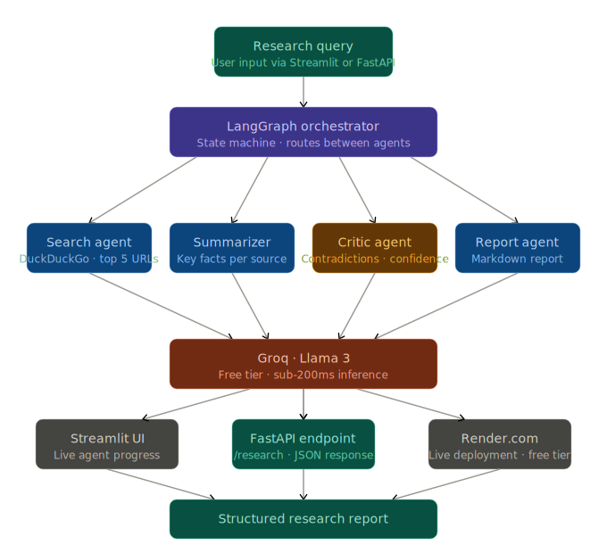

<div align="center">

# 🔬 Multi-Agent Research Assistant

### *LangGraph-Powered Autonomous Research Pipeline*


<br/>

> **4 Specialized Agents · Fact-Checked Output · Live REST API**
>
> *Type a research query. Watch 4 agents collaborate, cross-check, and compile a structured report — autonomously.*

<br/>

---

</div>

## 🧠 What is this?

A production-deployed **multi-agent research system** where specialized AI agents collaborate in a LangGraph state machine to autonomously research any topic. Unlike a simple RAG pipeline, this system uses a **Critic agent** to cross-check contradictions between sources — going beyond retrieval to genuine multi-step reasoning.

Built with **zero paid API cost** using Groq's free tier and DuckDuckGo search.

<br/>

---

## ⚡ Architecture


<br/>

---

## 🤖 The 4 Agents

| Agent | Role | Output |
|---|---|---|
| 🔍 **Search Agent** | Queries DuckDuckGo, retrieves top 5 sources | URLs + content summaries |
| 📝 **Summarizer Agent** | Extracts key facts from each source | Structured summaries per source |
| ⚖️ **Critic Agent** | Cross-checks claims, flags contradictions, assigns confidence | Contradiction report + confidence scores |
| 📋 **Report Agent** | Compiles verified summaries into final markdown | Structured research report |

<br/>

---

## 🛠️ Tech Stack

| Layer | Technology | Purpose |
|---|---|---|
| **Orchestration** | LangGraph | Agent state machine + routing |
| **Agents** | LangChain | Agent logic + tool use |
| **LLM** | Groq · Llama 3 | Intelligence layer (free tier) |
| **Search** | DuckDuckGo | Zero-cost web search |
| **API** | FastAPI + Uvicorn | REST endpoint serving |
| **Frontend** | Streamlit | Live agent progress UI |
| **Deployment** | Render.com | Free tier cloud hosting |

<br/>

---

## 🚀 Quick Start

### 1. Clone & Setup

```bash
git clone https://github.com/AnvitDevadiga/research-assistant.git
cd research-assistant
python3 -m venv venv
source venv/bin/activate
pip install -r requirements.txt
```

### 2. Configure Environment

```bash
cp .env.example .env
# Add your GROQ_API_KEY from console.groq.com (free)
```

### 3. Run Streamlit UI

```bash
streamlit run streamlit_app.py
```

### 4. Or use the REST API

```bash
uvicorn app.api:app --reload
curl -X POST http://localhost:8000/research \
  -H "Content-Type: application/json" \
  -d '{"query": "latest trends in AI agents"}'
```

<br/>

---

## 📡 API Reference

**POST** `/research`

```json
{
  "query": "your research question here"
}
```

**Response:**

```json
{
  "overview": "...",
  "key_findings": ["...", "..."],
  "contradictions": ["..."],
  "sources": ["https://...", "https://..."],
  "confidence": "HIGH"
}
```

<br/>

---

## 🧪 Example Output

**Query:** `"Latest trends in AI agents 2026"`

```
✅ 1. Search (DuckDuckGo)    — 5 sources retrieved
✅ 2. Summarizer             — Key facts extracted
✅ 3. Critic                 — 2 contradictions flagged
✅ 4. Report                 — Final report compiled

## Overview
AI agents in 2026 are characterized by...

## Key Findings
- Multi-agent orchestration frameworks saw 3x adoption growth
- LangGraph emerged as the dominant state machine approach...

## Contradictions Found
- Source A claims X; Source B disputes this with Y...

## Sources
- https://...
```

<br/>

---

## 🌐 Live Demo

Deployed at: **[research-assistant.onrender.com](https://research-assistant-k824.onrender.com)**

> Note: Free tier spins down after 15 min inactivity. First request may take ~30 seconds to wake up.

<br/>

---

## 📂 Project Structure

```
research-assistant/
│
├── app/
│   ├── agents/
│   │   ├── search_agent.py       # DuckDuckGo search + content fetch
│   │   ├── summarizer_agent.py   # LLM-powered summarization
│   │   ├── critic_agent.py       # Contradiction detection
│   │   └── report_agent.py       # Final report compilation
│   ├── graph.py                  # LangGraph state machine
│   ├── api.py                    # FastAPI REST endpoints
│   ├── llm.py                    # Groq LLM configuration
│   └── state.py                  # Shared agent state schema
│
├── streamlit_app.py              # Streamlit frontend
├── requirements.txt
├── Procfile                      # Render.com deployment
└── .env.example
```

<br/>

---

## 🔭 Roadmap

- [ ] Streaming SSE endpoint for real-time agent progress
- [ ] Memory layer — persist research sessions
- [ ] PDF export of final reports
- [ ] Docker deployment
- [ ] Agent performance benchmarking

<br/>

---

<div align="center">

**Built by [Anvit Devadiga](https://github.com/AnvitDevadiga)**

*AI Engineer · Multi-Agent Systems · Production Deployment*

[](https://github.com/AnvitDevadiga)
[](mailto:anvitdevadiga@outlook.com)

</div>
